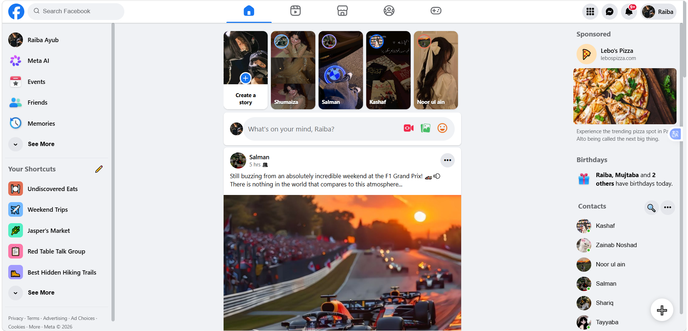

# Facebook Clone



A front-end recreation of Facebook's interface, built with **React** and **Vite**. This project focuses on replicating the core layout and interactive elements of the platform — including the news feed, stories, and a fully responsive design.

## Features

- 📰 **News Feed** — Dynamic post layout mirroring Facebook's feed structure
- 📸 **Stories Section** — Horizontally scrollable stories bar
- 📱 **Responsive Design** — Optimized for desktop, tablet, and mobile breakpoints

**##Live Demo##**
Live demo available at  - 

https://raibayub.github.io/kachy-dhaggy/

## Tech Stack

- **React 19**
- **Vite** — fast dev server and build tooling
- **ESLint** — code quality and consistency

## Getting Started

### Prerequisites

- Node.js (v18 or higher recommended)
- npm

## Project Structure

```
facebook-clone/
├── src/
│   ├── components/
│   ├── assets/
│   └── main.jsx
├── index.html
├── package.json
└── vite.config.js
```


## Author

**Raiba Ayub**
GitHub: [@raibayub](https://github.com/raibayub)

## License

This project is for educational and portfolio purposes only. Not affiliated with or endorsed by Meta/Facebook.
